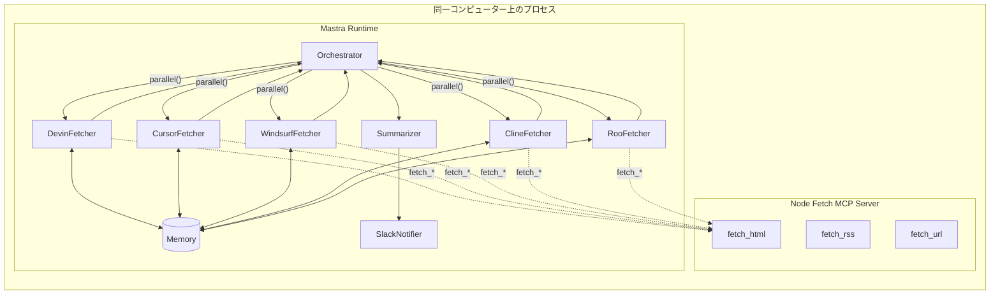

## 目次

1. 目的とゴール
2. 全体アーキテクチャ
3. Fetch MCP Server（Node.js）設計
4. Mastra エージェント設計
5. ワークフロー詳細
6. コード生成指示書（LLM へのプロンプト）
7. セキュリティ & 運用設計
8. 今後の拡張案

---

## 1. 目的とゴール

- **対象ツール**: Devin・Cursor・Windsurf・Cline・Roo Code の公式 Changelog から差分を検知し、日本時間毎朝 09:00 に要約を Slack へ投稿する。
- **要件**

  1. 収集処理は _5 並列_ で実行し 3 秒以内に完了すること。([Mastra.ai][1], [Mastra.ai][2])
  2. 取得はすべて **独自実装の Fetch MCP Server** の `fetch_rss` / `fetch_html` / `fetch_url` ツール経由で行うこと。
  3. Mastra 側は取得結果の差分判定・LLM 要約・通知に専念する疎結合構成。([Mastra.ai][6], [Mastra.ai][7])

---

## 2. 全体アーキテクチャ



- **並列実行**は Mastra の `workflow.parallel()` API で実装し、落ちた枝は自動リトライ。([Mastra.ai][1])
- **Fetch MCP Server** は同一コンピューター上で**ポート 9170** でツールを公開し、Mastra からは `localhost` 経由で `MCPClient` を通じて接続
- **メモリストア**はエージェント間で共有し、前回の情報と差分検出に使用する。

---

## 3. Fetch MCP Server（Node.js）設計

### 3.1 技術スタック

| 項目     | 採用技術                               | 根拠                               |
| -------- | -------------------------------------- | ---------------------------------- |
| 言語     | Node 20 + TypeScript                   | LTS・ネイティブ Fetch API あり     |
| SDK      | `@modelcontextprotocol/typescript-sdk` | MCP 公式 TS SDK                    |
| サーバー | Express                                | シンプルで高速な HTTP サーバー実装 |

### 3.2 独自サーバー実装

```ts
import express from 'express';
import { MCPServer } from '@mastra/mcp';
import { createTool } from '@mastra/core/tools';
import { z } from 'zod';
import { parse } from 'node-html-parser';
import Parser from 'rss-parser';

// RSS取得ツール（現状では使用しないが将来のために実装）
const fetchRssTool = createTool({
  id: 'fetch_rss',
  description: 'Fetch and parse a RSS feed',
  inputSchema: z.object({ url: z.string().url() }),
  outputSchema: z.object({
    items: z.array(
      z.object({
        title: z.string(),
        link: z.string().optional(),
        content: z.string().optional(),
        contentSnippet: z.string().optional(),
        pubDate: z.string().optional(),
        isoDate: z.string().optional(),
      })
    ),
  }),
  execute: async ({ context }) => {
    try {
      const parser = new Parser();
      const feed = await parser.parseURL(context.url);
      return { items: feed.items };
    } catch (error) {
      console.error('Error fetching RSS:', error);
      return { items: [] };
    }
  },
});

// HTML取得ツール
const fetchHtmlTool = createTool({
  id: 'fetch_html',
  description: 'Fetch HTML from a URL and parse it into a DOM structure',
  inputSchema: z.object({
    url: z.string().url(),
    selector: z.string().optional(), // オプションでCSSセレクタ指定可能
  }),
  outputSchema: z.object({
    title: z.string(),
    content: z.string(),
    elements: z
      .array(
        z.object({
          tag: z.string(),
          text: z.string(),
          html: z.string(),
        })
      )
      .optional(),
  }),
  execute: async ({ context }) => {
    try {
      const response = await fetch(context.url);
      const html = await response.text();
      const root = parse(html);

      // セレクタが指定されている場合は絞り込む
      const elements = context.selector ? root.querySelectorAll(context.selector) : [root];

      return {
        title: root.querySelector('title')?.text || '',
        content: html,
        elements: elements.map((el) => ({
          tag: el.tagName,
          text: el.text,
          html: el.innerHTML,
        })),
      };
    } catch (error) {
      console.error('Error fetching HTML:', error);
      return { title: '', content: '', elements: [] };
    }
  },
});

// URL 取得ツール
const fetchUrlTool = createTool({
  id: 'fetch_url',
  description: 'Fetch raw content from a URL',
  inputSchema: z.object({ url: z.string().url() }),
  outputSchema: z.object({ body: z.string() }),
  execute: async ({ context }) => {
    try {
      const response = await fetch(context.url);
      const body = await response.text();
      return { body };
    } catch (error) {
      console.error('Error fetching URL:', error);
      return { body: '' };
    }
  },
});

// 最新のパターンでツールをオブジェクトとして定義
const tools = {
  fetchRssTool,
  fetchHtmlTool,
  fetchUrlTool,
};

// MCP サーバー設定
const server = new MCPServer({
  name: 'Fetch MCP Server',
  version: '1.0.0',
  tools, // オブジェクトとして提供
});

// Express サーバーを起動
const app = express();
const PORT = process.env.PORT || 9170;

// MCPサーバーとExpressを統合
app.post('/api/tools/:toolId', async (req, res) => {
  // MCPからの呼び出しを処理
  const response = await server.handleToolCall(req.params.toolId, req.body);
  res.json(response);
});

app.get('/tools', async (req, res) => {
  // 利用可能なツール一覧を返す
  const toolManifest = server.getToolManifest();
  res.json(toolManifest);
});

app.listen(PORT, () => {
  console.log(`Fetch MCP Server running on port ${PORT}`);
});
```

- 認証は不要とし、すべてのツールは公開サイトからのデータ取得のみを行う。
- エラーハンドリングを実装し、ツール呼び出し失敗時も適切な空応答を返す。
- Node の標準 `fetch` API と一般的なパーサーライブラリを利用。

---

## 4. Mastra エージェント設計

### 4.1 共通設定 (`src/mastra/index.ts`)

```ts
import { Mastra } from '@mastra/core';
import { MCPClient } from '@mastra/mcp';
import { Memory } from '@mastra/memory';
import { LibSQLStore, LibSQLVector } from '@mastra/libsql';
import { orchestratorAgent } from './agents/orchestrator';
import { myWorkflow } from './workflows/main';
import { FETCH_MCP_URL } from '../config/constants';

// 永続的なストレージを設定
const storage = new LibSQLStore({
  connectionUrl: process.env.DATABASE_URL || 'file:./local.db', // url → connectionUrl に更新
});

// メモリを初期化（ストレージとベクトルストアを設定）
const memory = new Memory({
  storage: storage,
  vector: new LibSQLVector({
    connectionUrl: process.env.DATABASE_URL || 'file:./local.db',
  }),
  options: {
    lastMessages: 20, // スレッドごとの保持メッセージ数
    semanticRecall: {
      topK: 5, // 最も関連性の高い5つのメッセージを取得
      messageRange: 2, // 各マッチの前後2つのメッセージも含める
    },
  },
});

// MCPClient による接続（必要に応じて複数サーバーを設定可能）
const mcp = new MCPClient({
  servers: {
    fetch: {
      url: new URL(process.env.FETCH_MCP_URL || FETCH_MCP_URL || 'http://localhost:9170'),
      // 認証不要なので requestInit は省略
    },
  },
});

// Mastra インスタンスを作成（メモリとエージェント登録）
export const mastra = new Mastra({
  agents: { orchestratorAgent },
  workflows: { myWorkflow },
  storage: storage, // 同じストレージを全体で共有
});
```

### 4.2 エージェント一覧

| Agent           | 役割                       | 主要処理                               | URL                                            | メモリ処理                      |
| --------------- | -------------------------- | -------------------------------------- | ---------------------------------------------- | ------------------------------- |
| DevinFetcher    | Devin リリースノート取得   | MCP ツールの `fetch_html` を使用し取得 | https://docs.devin.ai/release-notes/overview   | `resourceId: "devin"` で保存    |
| CursorFetcher   | Cursor Changelog           | MCP ツールの `fetch_html` を使用し取得 | https://www.cursor.com/changelog               | `resourceId: "cursor"` で保存   |
| WindsurfFetcher | Windsurf リリース情報取得  | MCP ツールの `fetch_html` を使用し取得 | https://windsurf.com/editor/releases           | `resourceId: "windsurf"` で保存 |
| ClineFetcher    | Cline GitHub リリース      | MCP ツールの `fetch_html` を使用し取得 | https://github.com/cline/cline/releases        | `resourceId: "cline"` で保存    |
| RooFetcher      | Roo Code GitHub リリース   | MCP ツールの `fetch_html` を使用し取得 | https://github.com/RooVetGit/Roo-Code/releases | `resourceId: "roo"` で保存      |
| Orchestrator    | 並列実行／結果集約         | `workflow.parallel()` で並列処理       | -                                              | メモリ比較で差分抽出            |
| Summarizer      | GPT-4o で日本語 200 字要約 | `agent.generate()` で構造化出力生成    | -                                              | 履歴メモリを参照                |
| SlackNotifier   | Slack Webhook 投稿         | `createTool()` で Slack 投稿ツール作成 | -                                              | 履歴には記録なし                |

### 4.3 フェッチャーエージェント実装例（Devin）

```ts
import { Agent } from '@mastra/core/agent';
import { openai } from '@ai-sdk/openai';
import { z } from 'zod';
import { DEVIN_URL } from '../../config/constants';

export const devinFetcher = new Agent({
  name: 'DevinFetcher',
  instructions: `Devin の公式リリースノートページからリリース情報を取得し、前回との差分を抽出するエージェントです。
  取得先URL: ${DEVIN_URL}
  主な更新情報のセクションから新機能、改善点、バグ修正を抽出してください。`,
  model: openai('gpt-4o'),

  // メモリを使用して前回取得結果と比較
  memory: true, // Mastra インスタンスのメモリを使用

  // エラー時の自動リトライ
  maxRetries: 3,

  // 応答のコールバック
  onStepFinish: ({ text, toolCalls, toolResults }) => {
    console.log(`DevinFetcher step completed with ${toolCalls.length} tool calls`);
  },
});

// エージェントの呼び出し例
const result = await devinFetcher.generate('Get the latest Devin releases', {
  resourceId: 'devin', // メモリ内でこのエージェントのデータを識別
  threadId: 'daily-check', // 毎日の実行を同じスレッドで継続
  maxSteps: 3, // 最大で3回のツール使用を許可

  // 構造化出力の定義（差分データの型を明確に）
  output: z.object({
    newReleases: z.array(
      z.object({
        version: z.string(),
        date: z.string(),
        changes: z.array(z.string()),
      })
    ),
    hasChanges: z.boolean(),
  }),
});
```

### 4.4 URL設定定数ファイル (`src/config/constants.ts`)

```ts
// 各ツールのリリース情報取得先URL
export const DEVIN_URL = 'https://docs.devin.ai/release-notes/overview';
export const CURSOR_URL = 'https://www.cursor.com/changelog';
export const WINDSURF_URL = 'https://windsurf.com/editor/releases';
export const CLINE_URL = 'https://github.com/cline/cline/releases';
export const ROO_URL = 'https://github.com/RooVetGit/Roo-Code/releases';

// MCP Server設定
export const FETCH_MCP_URL = 'http://localhost:9170';

// Slack通知設定
export const SLACK_WEBHOOK_ENV = 'SLACK_WEBHOOK';

// CSS Selectors for specific content
export const DEVIN_SELECTOR = '.release-notes-container';
export const CURSOR_SELECTOR = '.changelog-entries';
export const WINDSURF_SELECTOR = '.releases-list';
export const GITHUB_RELEASES_SELECTOR = '.release-entry'; // 共通のGitHubリリースセレクタ
```

---

## 5. ワークフロー詳細

### 5.1 ワークフロー定義

```ts
import { Workflow, Step } from '@mastra/core/workflows';
import { z } from 'zod';
import {
  devinFetcher,
  cursorFetcher,
  windsurfFetcher,
  clineFetcher,
  rooFetcher,
} from '../agents/fetchers';
import { summarizer } from '../agents/summarizer';
import { slackNotifier } from '../agents/notifier';

// ワークフローの定義
export const releaseWorkflow = new Workflow({
  name: 'release-summarizer',
  triggerSchema: z.object({
    date: z.string().optional(),
  }),
});

// 各フェッチャーをステップとして定義
const devinStep = new Step({
  id: 'devin-step',
  execute: async ({ context }) => {
    const result = await devinFetcher.generate('Get latest releases', {
      resourceId: 'devin',
      threadId: 'daily-check',
    });
    return result.object;
  },
});

// 同様に他のフェッチャーステップも定義...

// 要約ステップの定義
const summaryStep = new Step({
  id: 'summary-step',
  execute: async ({ context }) => {
    // 各フェッチャーの結果を取得
    const devinResult = context.getStepResult(devinStep);
    const cursorResult = context.getStepResult(cursorStep);
    // ... 他のフェッチャーの結果も同様に取得

    // 変更があるもののみを抽出
    const changedTools = [
      devinResult.hasChanges ? devinResult : null,
      cursorResult.hasChanges ? cursorResult : null,
      // ... 他のフェッチャー結果も同様に
    ].filter(Boolean);

    if (changedTools.length === 0) {
      return { summary: '本日の変更はありません', hasChanges: false };
    }

    // 要約を生成
    const summaryResult = await summarizer.generate(
      `以下のリリース情報を200字以内の日本語で要約してください: ${JSON.stringify(changedTools)}`,
      {
        output: z.object({
          summary: z.string(),
          toolsUpdated: z.array(z.string()),
        }),
      }
    );

    return summaryResult.object;
  },
});

// 通知ステップの定義
const notifyStep = new Step({
  id: 'notify-step',
  execute: async ({ context }) => {
    const summary = context.getStepResult(summaryStep);

    if (!summary.hasChanges) {
      console.log('変更なしのため通知はスキップします');
      return { notified: false };
    }

    // Slack通知を送信
    await slackNotifier.generate(`以下の内容をSlackに投稿してください: ${summary.summary}`);
    return { notified: true };
  },
});

// ワークフローの構成
releaseWorkflow
  .parallel([devinStep, cursorStep, windsurfStep, clineStep, rooStep])
  .then(summaryStep)
  .then(notifyStep)
  .commit();
```

### 5.2 ワークフロー実行フロー

| フェーズ  | 入力                   | MCP ツール           | Mastra での処理                                 | 出力                                        | エラー処理                         |
| --------- | ---------------------- | -------------------- | ----------------------------------------------- | ------------------------------------------- | ---------------------------------- |
| ①取得     | 各 URL                 | `fetch_html`         | HTML受信 + resourceId/threadIdでメモリに保存    | 構造化された差分データ (JSON 形式)          | 最大3回自動リトライ (`maxRetries`) |
| ②並列集約 | 5つのフェッチ結果      | —                    | workflow.getStepResult() で各ステップ結果を取得 | 更新があったツールのリスト                  | —                                  |
| ③要約     | 変更があったツール情報 | —                    | structuredOutput 型定義で厳密なフォーマット管理 | 構造化された要約 (日本語 200 字 + メタ情報) | —                                  |
| ④通知     | 要約                   | `slack.post_message` | 変更がある場合のみSlack送信                     | 通知ステータス                              | —                                  |

---

## 6. コード生成指示書（LLM へのプロンプト）

> **以下を厳守して TypeScript プロジェクトを生成してください。**

1. **ディレクトリ構成**

   ```
   src/
     mastra/
       index.ts          # Mastra/Memory/MCP初期化
       agents/
         fetchers/{devin,cursor,windsurf,cline,roo}.ts
         orchestrator.ts
         summarizer.ts
       tools/
         slack.ts        # createTool で Slack 通知ツール作成
       workflows/
         main.ts         # parallel() を使用したワークフロー
     mcp-server/        # 独自実装の MCP Server
       server.ts
       tools/
         fetch-rss.ts
         fetch-html.ts
         fetch-url.ts
     utils/
       diffStore.ts     # メモリを活用した差分検出
     config/
       constants.ts     # 各ツールのURL等定数
   ```

2. **依存ライブラリ**

   - `"@mastra/core": "latest"`
   - `"@mastra/mcp": "latest"`
   - `"@mastra/memory": "latest"`
   - `"@mastra/libsql": "latest"`
   - `"@ai-sdk/openai": "latest"`
   - `"zod": "^3"`
   - `"express": "^4"`
   - `"node-html-parser": "^6"`
   - `"rss-parser": "^3"`

3. **独自 Fetch MCP Server**

   - ポート `9170`。
   - Express と `MCPServer` クラスで統合。
   - 主に `fetch_html` ツールを使用して全サービスから情報取得。
   - 認証は不要、パブリックなサイトへのアクセスのみ。

4. **Mastra Fetcher Agent**

   - `Agent` クラスと最新構文で実装、`output`パラメータで構造化出力。
   - `MCPClient` を介して MCP ツールに接続。
   - CSS セレクタを使って必要な部分だけを抽出。
   - 各サービスの正確なURL:
     - Devin: https://docs.devin.ai/release-notes/overview
     - Cursor: https://www.cursor.com/changelog
     - Windsurf: https://windsurf.com/editor/releases
     - Cline: https://github.com/cline/cline/releases
     - Roo: https://github.com/RooVetGit/Roo-Code/releases

5. **並列実行**

   - `Workflow` と `Step` クラスを使用し、`parallel([...])` で並列処理。
   - `getStepResult()` で前のステップの結果を参照し連携。

6. **要約**

   - System プロンプト: `「あなたはシニアテックライター…」`
   - `agent.generate()` で `output:` スキーマ指定による構造化出力。

7. **通知**

   - Slack Webhook URL は `SLACK_WEBHOOK` 環境変数。
   - `createTool()` で型安全な Slack 通知ツールを作成。

8. **エラーハンドリング**

   - `agent.maxRetries` と `onStepFinish` コールバックを実装。
   - ワークフローの `onError` ハンドラでエラーログ保存と通知。
   - MCP ツールは例外をキャッチし空データを返すことでグレースフル障害対応。

9. **テスト**

   - 各 Fetcher の実装を `vitest` でテスト。
   - メモリストア用のモックを作成し、`Memory` をテスト。
   - 各サービスのHTMLサンプルを用意してパース処理をテスト。

10. **ドキュメント**

    - `README.md` に `.env.example` と起動手順を記載。
    - 各環境変数の説明と必要なアクセス権について明記。

---

## 7. セキュリティ & 運用設計

- **メモリストレージ** は `@mastra/libsql` か `@mastra/pg` による永続化。開発中は `file:./local.db` を使用。
- **スレッド管理** はツール別 `resourceId` と日次実行 `threadId` の組み合わせで整理。
- **レート制限** は Fetch MCP 側で `100 req/min` の自主制限実装、429 エラー時はバックオフ。
- **アクセス先の制限** - パブリックサイトのみアクセスし、認証が必要なサイトは対象外。GitHubのパブリックリポジトリは認証不要でアクセス可能。
- **TLS**: 社内ネットでも HTTPS を必須とし、自己署名証明書を Cloud-flare Origin Cert で置換。
- **オブザーバビリティ** : Mastra のログを収集し、エラー発生時にアラート設定。

---

## 8. 今後の拡張案

1. **ベクトル検索** — RAG パターンを実装し、`createVectorQueryTool()` + `createDocumentChunkerTool()` で Q&A 機能を追加。([Mastra.ai][7])
2. **SSE Push** — Fetch MCP が更新を検知して Mastra に SSE 送信、ポーリングを廃止。
3. **対象ツールの追加** — 新しいコーディングツールの登場に合わせて、モジュラーに新規フェッチャーを追加。
4. **ワークフローの vNext 対応** — 新しい API はすでに標準であるため、`parallel()` など最新のAPIを使用。
5. **セマンティックメモリ** — 過去のリリース情報からの高度な類似検索のため、`@mastra/memory` の semantic recall 機能を実装。
6. **リアルタイム通知** — Slackだけでなく他の通知システムへの対応も追加検討。

---

これで、生成 AI にコード生成を依頼する際に必要な前提・構成・実装指針がすべて揃いました。設計書をそのままプロンプトに渡せば、完全自動で TypeScript リポジトリが生成される想定です。

[1]: https://mastra.ai/examples/workflows_vNext/parallel-steps?utm_source=chatgpt.com 'Example: Parallel Execution | Workflows | Mastra Docs'
[2]: https://mastra.ai/examples/workflows/parallel-steps?utm_source=chatgpt.com 'Example: Parallel Execution | Workflows | Mastra Docs'
[6]: https://mastra.ai/docs/agents/mcp-guide?utm_source=chatgpt.com 'Using MCP With Mastra | Agents'
[7]: https://mastra.ai/docs/agents/02a-mcp-guide?utm_source=chatgpt.com 'Using MCP With Mastra | Agents'
[10]: https://modelcontextprotocol.io/docs/concepts/tools?utm_source=chatgpt.com 'Tools - Model Context Protocol'
[11]: https://modelcontextprotocol.io/specification/2025-03-26/basic/index?utm_source=chatgpt.com 'Overview - Model Context Protocol'
